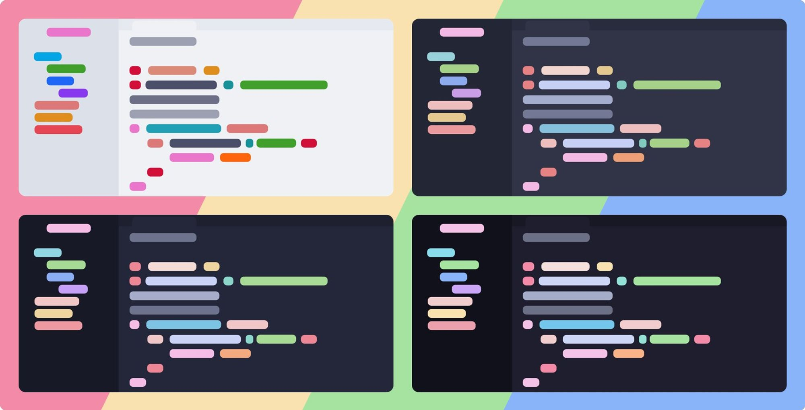

<h3 align="center">
  <br/>
  
  Catppuccin Toolbox
  
</h3>

<p align="center">
  <a href="https://github.com/catppuccin/toolbox/stargazers"></a>
  <a href="https://github.com/catppuccin/toolbox/issues"></a>
  <a href="https://github.com/catppuccin/toolbox/contributors"></a>
</p>



## Catppuccin's development tools

A set of software tools by Catppuccin developers, for Catppuccin developers.

- [Catwalk](https://github.com/catppuccin/toolbox/tree/main/catwalk#readme)
- [Whiskers (separate repository)](https://github.com/catppuccin/whiskers)

&nbsp;

## Nix

### With Flakes

Add the following to your `flake.nix`:

#### NixOS

```nix
{
    inputs = {
        catppuccin-toolbox.url = "github:catppuccin/whiskers";
    };
    outputs = {nixpkgs, catppuccin-whiskers, ...}: {
        nixosConfigurations.HOSTNAME = nixpkgs.lib.nixosSystem {
          modules = [
          {
              environment.systemPackages = [
                catppuccin-whiskers.packages.${pkgs.system}.default
              ];
            }
          ];
        };
      };
    }
}
```

#### Home Manager

```nix
{
  inputs = {
    nixpkgs.url = "github:NixOS/nixpkgs/nixos-unstable";

    home-manager = {
      url = "github:nix-community/home-manager";
      inputs.nixpkgs.follows = "nixpkgs";
    };

    catppuccin-whiskers.url = "github:catppuccin/whiskers";
  };

  outputs = {nixpkgs, home-manager, catppuccin-whiskers, ...}: {
    homeConfigurations."user@hostname" = home-manager.lib.homeManagerConfiguration {
      pkgs = nixpkgs.legacyPackages.x86_64-linux;

      modules = [
        {
            home.packages = [
                catppuccin-whiskers.packages.${pkgs.system}.default
            ];
        }
      ];
    };
  };
}
```

### Without Flakes

Add the following to your configuration:

```nix
{config, pkgs, ...}: let
  flake-compat = builtins.fetchTarball "https://github.com/edolstra/flake-compat/archive/master.tar.gz";
  catppuccin-whiskers = (import flake-compat {
    src = builtins.fetchTarball "https://github.com/catppuccin/whiskers/archive/main.tar.gz";
  }).defaultNix;
in {
    # Home Manager
    home.packages = [
        catppuccin-whiskers.packages.${pkgs.system}.default
    ];

    # Nix
    environment.systemPackages = [
        catppuccin-whiskers.packages.${pkgs.system}.default
    ];
}
```

&nbsp;

<p align="center"></p>
<p align="center">Copyright &copy; 2021-present <a href="https://github.com/catppuccin" target="_blank">Catppuccin Org</a>
<p align="center"><a href="https://github.com/catppuccin/catppuccin/blob/main/LICENSE"></a></p>
